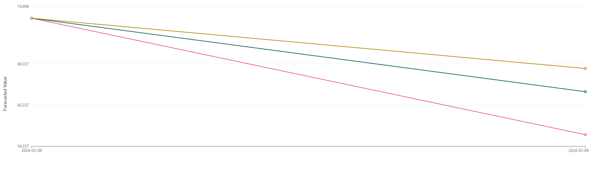
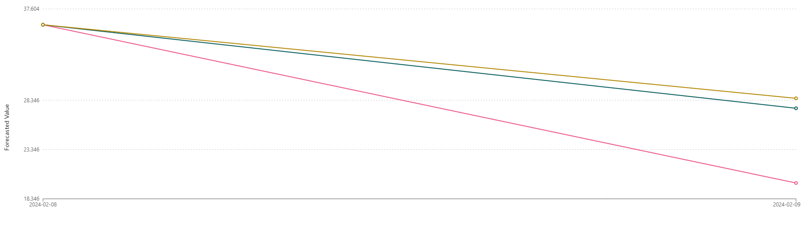
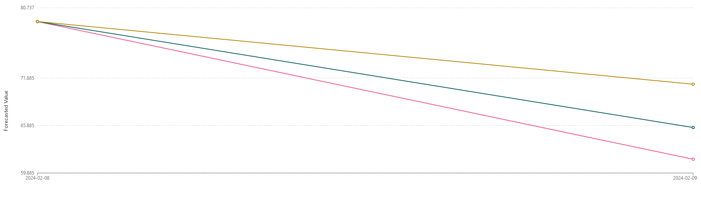

# Capacitação - Digital Innovation One

## Projeto

- 📊 Previsão de Estoque Inteligente na AWS com [SageMaker Canvas](https://aws.amazon.com/pt/sagemaker/canvas/)

## Conhecimentos praticados

- Aplicação de conceitos práticos de Machine Learning (ML) utilizando o SageMaker Canvas

## Execução

### 1. Criação do modelo

- Selecionado modelo de análise preditiva a partir de conjunto de dados tabulares.

### 2. Seleção do Dataset

- Escolhido o dataset `dataset-1000-com-preco-promocional-e-renovacao-estoque.csv` disponibilizado no repositório de exemplo do projeto.
- Arquivo possui 1000 linhas e 5 colunas (ID_PRODUTO, DATA_EVENTO, PRECO, FLAG_PROMOCAO, QUANTIDADE_ESTOQUE).

### 2. Construção e Treinamento

A preparação dos dados é crucial para o sucesso do modelo. Isso inclui a configuração e também a higienização dos dados, que envolve limpar e organizar os dados para garantir que o modelo possa aprender com eles de forma eficaz.

- Ao selecionar a coluna alvo `QUANTIDADE_ESTOQUE`, o Canvas sugeriu o tipo de modelo *Time series forecasting* que fará a previsão da quantidade de estoque usando os dados passados para prever os valores futuros.
- A coluna `ID_PRODUTO` foi escolhida como identificador único.
- A coluna `DATA_EVENTO` foi escolhida como coluna que contem data/hora.
- Optei por não selecionar a agenda de feriados na configuração do modelo.
- Para os valores faltantes da coluna `PRECO` foi aplicada a mediana.
- Para os valores faltantes da coluna `QUANTIDADE_ESTOQUE` foi aplicado o valor 0.
- Para acelerar o processo de geração, selecionei a opção *Quick Build*.

### 3. Análise

#### Métricas

- **Avg. wQL (Média da Perda Quantil Ponderada):** Essa métrica mede o erro nas previsões, ponderado pela importância de cada item. Um valor menor indica maior precisão nas previsões.
- **MAPE (Erro Percentual Médio Absoluto):** Calcula a média da porcentagem de erro das previsões em relação aos valores reais. Um MAPE menor indica maior precisão nas previsões.
- **WAPE (Erro Percentual Absoluto Ponderado):** Similar ao MAPE, mas leva em consideração a importância de cada item no estoque. Isso significa que itens de maior valor ou importância terão um impacto maior na métrica. Um WAPE menor é desejável, pois indica que o modelo está prevendo com mais precisão para os itens mais críticos, o que é essencial para uma gestão eficiente do estoque.
- **RMSE (Raiz do Erro Quadrático Médio):** Mede a diferença média entre os valores previstos e os valores reais, dando mais peso a grandes erros. Um RMSE menor é melhor, pois indica que as previsões estão, em média, próximas dos valores reais.
- **MASE (Erro Escalado Médio Absoluto):** Compara o erro da previsão com um modelo simples. Um valor de MASE menor que 1 indica que o modelo está fazendo previsões mais precisas do que simplesmente usar a média histórica.

#### Status do Modelo

| Avg. wQL | MAPE | WAPE | RMSE | MASE |
| ---: | ---: | ---: | ---: | ---: |
| 0.060 | 0.148 | 0.100 | 5.765 | 0.301 |

#### Impacto das colunas

- PRECO: 9,61%
- FLAG_PROMOCAO: 0%

### 4. Previsão

#### Quantis

- **P10 (10º Percentil):** Representa um valor abaixo do qual 10% das previsões estão. Indica um cenário de baixa demanda.
- **P50 (50º Percentil):** Este é o valor mediano nas previsões, mostrando a demanda média esperada.
- **P90 (90º Percentil):** Indica um valor acima do qual 10% das previsões estão. Reflete um cenário de alta demanda.

#### Resultados

- Por se tratar de acesso gratuito à ferramenta, a previsão em lote não pode ser executada devido ao limite de cotas da conta.
- Para o tipo de previsão simples, seguem os resultados para três itens aleatórios:
  - Item 1016
  
  - Item 1021
  
  - Item 1024
  
